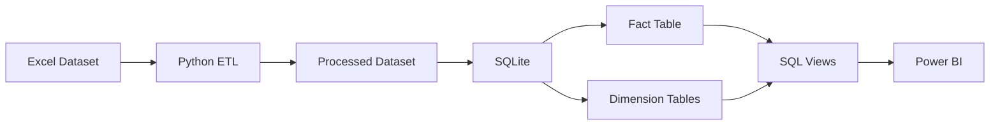

# Data Architecture

**Project:** HR Attrition & Workforce Analytics Platform

**Version:** 1.0

**Document Type:** Data Architecture

**Status:** Final

---

# 1. Overview

This document describes the logical and physical data architecture implemented for the HR Attrition & Workforce Analytics Platform.

The architecture follows a dimensional Star Schema to support analytical reporting, SQL-based KPI generation, and Power BI dashboard visualization.

The design prioritizes:

- Simplicity
- Query performance
- Data consistency
- Dashboard usability
- Scalable analytical reporting

---

# 2. Data Architecture Overview

The analytics platform follows a layered architecture.

```text
Raw Excel Dataset
        │
        ▼
Python ETL Pipeline
        │
        ▼
Processed Dataset
        │
        ▼
SQLite Data Warehouse
        │
        ▼
Star Schema
        │
        ▼
SQL Views
        │
        ▼
Power BI Dashboard
```

---

# 3. Data Flow



---

# 4. Star Schema

The analytical database implements a classic Star Schema consisting of one central Fact table surrounded by multiple Dimension tables.

```text
                   Dim_Department
                         │
Dim_JobRole ───── Fact_Employee ───── Dim_Education
                         │
                 Dim_MaritalStatus
```

The schema minimizes query complexity while supporting efficient aggregations and interactive dashboard filtering.

---

# 5. Design Principles

The data model follows these principles:

- Single source of truth
- One Fact table
- Multiple reusable Dimension tables
- No duplicated business logic
- SQL-first KPI calculations
- Optimized for analytical workloads
- Compatible with Power BI relationships

---

# 6. Data Model Summary

| Component | Count |
|-----------|------:|
| Fact Tables | 1 |
| Dimension Tables | 4 |
| Analytical Views | Multiple |
| Records | 1,470 |
| Employee Attributes | 43 |

---

# 7. Design Decisions

### Why Star Schema?

The Star Schema was selected because it:

- Simplifies analytical queries.
- Improves Power BI performance.
- Reduces query complexity.
- Enables reusable SQL views.
- Supports dimensional filtering.

---

### Why no Date Dimension?

The dataset contains:

- No Hire Date
- No Termination Date
- No Review Date
- No Calendar Events

Therefore a Date Dimension would require fabricated information and has intentionally been excluded.

---

### Grain

The Fact table stores exactly **one record per employee**.

Primary Key:

```
Employee Number
```

Each employee appears only once in the warehouse.

---
# 8. Fact Table

The central table of the analytical warehouse is **Fact_Employee**, which stores workforce measures and employee-level metrics.

---

## Table Grain

**One record per employee**

Primary Key:

```
Employee Number
```

Each employee appears exactly once within the warehouse.

---

## Measures

The Fact table stores quantitative workforce metrics including:

| Category | Attributes |
|-----------|------------|
| Compensation | Monthly Income, Daily Rate, Hourly Rate, Monthly Rate |
| Experience | Total Working Years, Years At Company, Years In Current Role |
| Satisfaction | Job Satisfaction, Environment Satisfaction, Relationship Satisfaction, Work-Life Balance |
| Performance | Performance Rating, Percent Salary Hike |
| Workforce | Distance From Home, Training Times Last Year |
| Benefits | Stock Option Level |
| Employment | Attrition, Over Time |

---

## Foreign Keys

The Fact table references the following dimensions.

| Foreign Key | References |
|-------------|------------|
| DepartmentKey | Dim_Department |
| JobRoleKey | Dim_JobRole |
| EducationKey | Dim_Education |
| MaritalStatusKey | Dim_MaritalStatus |
| BusinessTravelKey | Dim_BusinessTravel |

---

# 9. Dimension Tables

The warehouse contains reusable dimension tables to eliminate redundancy and improve query performance.

---

## Dim_Department

Stores department information.

| Attribute |
|------------|
| DepartmentKey |
| DepartmentName |

---

## Dim_JobRole

Stores employee job roles.

| Attribute |
|------------|
| JobRoleKey |
| JobRoleName |
| DepartmentKey |

---

## Dim_Education

Stores employee education information.

| Attribute |
|------------|
| EducationKey |
| EducationLevel |
| EducationField |

---

## Dim_MaritalStatus

Stores employee marital status.

| Attribute |
|------------|
| MaritalStatusKey |
| MaritalStatusName |

---

## Dim_BusinessTravel

Stores employee travel frequency.

| Attribute |
|------------|
| BusinessTravelKey |
| BusinessTravel |

---

# 10. Relationships

The analytical model follows a classic Star Schema.

```text
Dim_Department
        │
        │
Dim_JobRole ─── Fact_Employee ─── Dim_Education
        │
        │
Dim_MaritalStatus
        │
        │
Dim_BusinessTravel
```

Relationship characteristics:

- One-to-Many
- Single Direction Filtering
- No Circular Relationships
- No Snowflake Design

This structure improves analytical query performance while simplifying Power BI relationships.

---

# 11. Data Dictionary

## Employee Identifiers

| Field | Description |
|---------|-------------|
| Employee Number | Primary employee identifier |
| DepartmentKey | Department dimension key |
| JobRoleKey | Job role dimension key |
| EducationKey | Education dimension key |

---

## Workforce Metrics

| Field | Description |
|---------|-------------|
| Attrition | Employee left organization |
| Over Time | Employee works overtime |
| Job Satisfaction | Satisfaction score |
| Work Life Balance | Work-life balance score |
| Performance Rating | Employee performance score |

---

## Compensation

| Field | Description |
|---------|-------------|
| Monthly Income | Employee monthly salary |
| Daily Rate | Daily pay rate |
| Hourly Rate | Hourly pay rate |
| Stock Option Level | Employee stock benefit level |

---

## Experience

| Field | Description |
|---------|-------------|
| Years At Company | Company tenure |
| Total Working Years | Professional experience |
| Years In Current Role | Current role tenure |
| Years Since Last Promotion | Promotion history |

---

# 12. Data Lineage

The following lineage illustrates how data moves throughout the platform.

```text
Raw Excel Dataset

↓

Python ETL

↓

Processed Dataset

↓

SQLite Staging

↓

Dimension Tables

↓

Fact Table

↓

SQL Views

↓

Power BI Dashboard

↓

Business Reports
```

Each stage consumes validated output from the previous stage.

The original dataset remains unchanged throughout processing.

---

# 13. SQL Analytical Views

Reusable SQL views simplify reporting and maintain KPI consistency.

| View | Purpose |
|------|---------|
| Workforce Summary | Workforce overview |
| Department Summary | Department metrics |
| Compensation Summary | Salary analytics |
| Satisfaction Summary | Employee satisfaction |
| Attrition Summary | Attrition reporting |
| Tenure Summary | Employee experience |

These views act as the analytical layer consumed by Power BI.

---

# 14. Data Integrity

The platform enforces several integrity rules.

## Entity Integrity

- Employee Number is unique.
- One record represents one employee.
- No duplicate employee identifiers.

---

## Referential Integrity

All foreign keys reference valid dimension records.

No orphaned records are permitted.

---

## Domain Integrity

Validation includes:

- Satisfaction Scores (1–4)
- Education Levels (1–5)
- Stock Option Levels (0–3)
- Attrition (Yes / No)
- Overtime (Yes / No)

---

# 15. Data Quality Strategy

The ETL pipeline performs several quality checks before loading data.

Checks include:

- Missing value detection
- Duplicate detection
- Schema validation
- Data type validation
- Constant-value detection
- Domain validation
- Row count verification

Only validated data is loaded into the warehouse.

---

# 16. Design Decisions

Several important architectural decisions influence the data model.

### Star Schema

Selected for analytical performance and Power BI compatibility.

---

### No Date Dimension

The dataset contains no calendar dates.

Time intelligence is therefore intentionally excluded.

---

### Snapshot Data

The warehouse represents a point-in-time workforce snapshot.

Historical trend analysis is outside the project scope.

---

### SQL-First Analytics

Business KPIs are generated within SQL rather than Power BI.

This ensures:

- Reusable calculations
- Easier validation
- Centralized business logic

---

# 17. Future Enhancements

The data architecture can be extended through:

### Database

- PostgreSQL
- Azure SQL
- Microsoft Fabric
- Snowflake

---

### Data Modeling

- Date Dimension
- Slowly Changing Dimensions (SCD Type 2)
- Factless Fact Tables
- Historical Workforce Snapshots

---

### Analytics

- Predictive Attrition Models
- Workforce Forecasting
- Employee Risk Scoring
- AI-powered KPI Insights

---

# 18. Data Architecture Summary

The analytical warehouse is implemented using a dimensional Star Schema that separates workforce measures from descriptive employee attributes.

This design provides:

- High-performance analytical queries
- Reusable business dimensions
- Centralized KPI calculations
- Simplified Power BI relationships
- Consistent workforce reporting

The architecture is intentionally lightweight while remaining extensible for future enterprise-scale deployments.

---