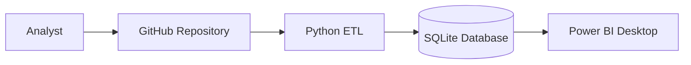

# High-Level Design (HLD)

**Project:** HR Attrition & Workforce Analytics Platform

**Version:** 1.0

**Document Type:** High-Level Design (HLD)

**Status:** Final

---

# 1. Overview

This document describes the high-level architecture of the HR Attrition & Workforce Analytics Platform.

The solution transforms raw employee data into actionable workforce intelligence through a layered analytics architecture consisting of:

- Data Ingestion
- Data Engineering
- Data Warehousing
- Business Intelligence
- Executive Reporting

The architecture is designed to be modular, scalable, maintainable, and suitable for analytical workloads.

---

# 2. System Objectives

The platform is designed to:

- Automate HR data preparation.
- Improve data quality through validation.
- Centralize workforce analytics.
- Build reusable SQL analytical models.
- Deliver interactive Power BI dashboards.
- Support evidence-based HR decision-making.

---

# 3. High-Level Architecture


---

# 4. Architecture Layers

| Layer | Purpose |
|---------|---------|
| Data Source | Stores the original HR dataset |
| ETL Layer | Cleans, validates, and transforms employee data |
| Database Layer | Stores analytical Star Schema |
| SQL Analytics Layer | Calculates business KPIs |
| Visualization Layer | Interactive Power BI dashboard |
| Business Layer | Executive insights and recommendations |

---

# 5. Major Components

## 5.1 Data Source

### Responsibilities

- Store original employee records.
- Preserve source integrity.
- Serve as the single source of truth.

### Input

```
Analytics/Excel/HR DATA_Excel.xlsx
```

### Output

Raw HR dataset

---

## 5.2 Python ETL Layer

### Responsibilities

- Data ingestion
- Data profiling
- Data validation
- Data cleaning
- Feature preparation
- Logging
- Export processed dataset

### Output

Analytics-ready dataset

---

## 5.3 Database Layer

The database layer stores cleaned employee data within a dimensional Star Schema.

Responsibilities include:

- Fact table creation
- Dimension table creation
- Relationship management
- Data loading

---

## 5.4 SQL Analytics Layer

The SQL layer acts as the analytical engine.

Responsibilities include:

- KPI generation
- Department analysis
- Attrition analysis
- Workforce reporting
- Business views

---

## 5.5 Power BI Layer

Power BI provides interactive business intelligence for HR stakeholders.

Dashboard capabilities include:

- Workforce Overview
- Attrition Analysis
- Employee Demographics
- Department Analysis
- Education Analysis
- Executive KPIs

---

## 5.6 Business Insights Layer

The final layer converts analytical results into business recommendations.

Outputs include:

- Workforce insights
- Attrition drivers
- Retention opportunities
- Executive reporting

---
# 6. Component Interactions

The platform follows a layered architecture where each component has a clearly defined responsibility.

| Source Component | Destination Component | Interaction |
|------------------|-----------------------|-------------|
| Excel Dataset | Python ETL | Reads raw employee data |
| Python ETL | Processed Dataset | Cleans and validates data |
| Processed Dataset | SQLite Database | Loads structured employee records |
| SQLite Database | SQL Views | Generates reusable analytical datasets |
| SQL Views | Power BI | Supplies data for visualization |
| Power BI | Business Users | Delivers interactive dashboards and insights |

The architecture follows a one-way data flow to eliminate circular dependencies and simplify maintenance.

---

# 7. System Interfaces

## Input Interface

| Interface | Description |
|------------|-------------|
| Excel Workbook | Primary data source containing employee records |

---

## Processing Interface

| Interface | Description |
|------------|-------------|
| Python ETL | Data extraction, validation, cleaning, and transformation |
| SQLite | Stores dimensional analytical model |
| SQL Scripts | Generate reusable KPI views |

---

## Output Interface

| Interface | Description |
|------------|-------------|
| Power BI Dashboard | Interactive workforce analytics |
| Business Reports | Executive insights and recommendations |

---

# 8. Data Flow Summary

The complete processing workflow is illustrated below.

```text
Raw Excel Dataset

↓

Python Validation

↓

Data Cleaning

↓

Processed Dataset

↓

SQLite Database

↓

Star Schema

↓

SQL KPI Views

↓

Power BI Dashboard

↓

Business Insights
```

Each stage consumes output from the previous stage without modifying upstream data.

---

# 9. Deployment Architecture

Current deployment follows a local analytics workflow.



The repository is designed for local execution and portfolio demonstration.

---

# 10. Design Constraints

The current architecture intentionally operates within the following constraints.

| Constraint | Reason |
|------------|--------|
| Static Dataset | No live HRIS connection |
| Local Execution | Portfolio project scope |
| Batch Processing | Manual execution is sufficient |
| Snapshot Analytics | Dataset contains no historical dates |
| Single User | No concurrent users |

These constraints reduce unnecessary complexity while supporting the project objectives.

---

# 11. Design Assumptions

The architecture assumes:

- Source data is structurally consistent.
- Employee Number uniquely identifies each employee.
- Attrition is represented by a single canonical field.
- Dataset represents a single workforce snapshot.
- Business KPIs are calculated within the SQL layer.
- Dashboard users are business stakeholders rather than technical users.

---

# 12. Future Architecture

The solution can be extended for enterprise deployment.

Potential enhancements include:

### Data Engineering

- Azure Data Factory
- Apache Airflow
- Incremental ETL
- Data Quality Monitoring

---

### Database

- Azure SQL Database
- PostgreSQL
- Snowflake
- Microsoft Fabric Warehouse

---

### Business Intelligence

- Power BI Service
- Scheduled Refresh
- Row-Level Security
- Executive Scorecards

---

### Advanced Analytics

- Predictive Attrition Modeling
- Employee Risk Scoring
- Workforce Forecasting
- AI-assisted HR Insights

---

# 13. HLD Summary

The High-Level Design separates the solution into independent architectural layers responsible for data ingestion, processing, storage, analytics, and visualization.

This layered architecture provides:

- Clear separation of responsibilities
- Improved maintainability
- Simplified scalability
- Reusable analytical components
- Consistent KPI generation
- Interactive business reporting

The architecture is intentionally lightweight while following enterprise Business Intelligence design principles, making it suitable for both portfolio demonstration and future production enhancement.

---