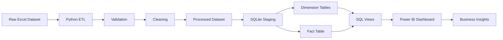
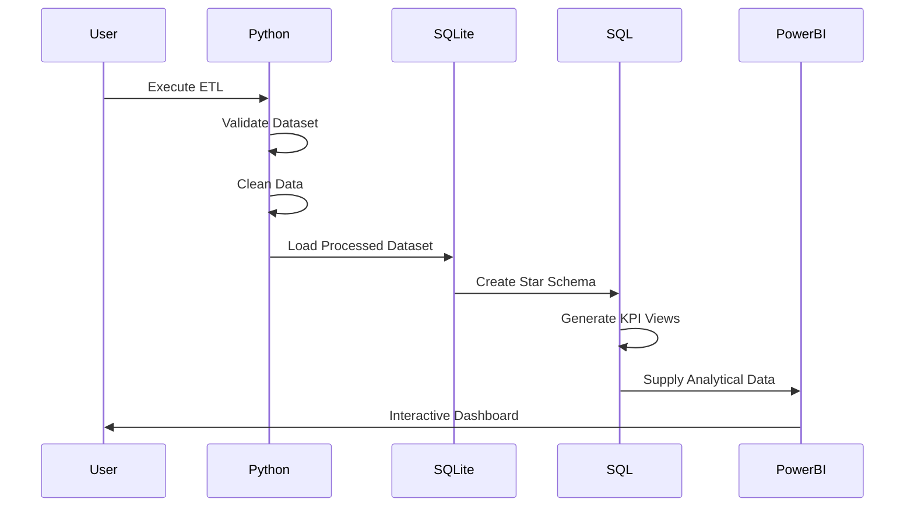

# Low-Level Design (LLD)

**Project:** HR Attrition & Workforce Analytics Platform

**Version:** 1.0

**Document Type:** Low-Level Design (LLD)

**Status:** Final

---

# 1. Overview

This document describes the detailed implementation of the HR Attrition & Workforce Analytics Platform, including data flow, ETL processing, validation logic, SQL modeling, and dashboard integration.

While the High-Level Design (HLD) describes the overall architecture, this document focuses on the internal implementation of each processing stage.

---

# 2. End-to-End Data Flow

The platform follows a sequential ETL workflow.



---

# 3. Detailed Pipeline Flow

## Stage 1 – Data Extraction

### Input

```
Analytics/Excel/HR DATA_Excel.xlsx
```

### Operations

- Read the Excel **Data** worksheet.
- Preserve the original dataset.
- Validate worksheet availability.
- Import employee records into memory.

### Output

Raw DataFrame

---

## Stage 2 – Data Validation

Before any transformation begins, the dataset undergoes schema validation.

### Validation Rules

| Validation | Rule |
|------------|------|
| Employee Number | Unique |
| Dataset Columns | Expected schema |
| Missing Values | Checked |
| Data Types | Verified |
| Categorical Values | Validated |
| Numerical Ranges | Verified |

If critical validation fails, pipeline execution stops.

---

## Stage 3 – Data Cleaning

Cleaning operations include:

- Remove constant-value columns
- Remove undocumented placeholder columns
- Normalize column names
- Standardize data types
- Validate categorical domains
- Generate derived attributes

No records are removed unless explicitly required.

---

## Stage 4 – Feature Engineering

Derived attributes include:

- Age Band
- Department Categories
- KPI-ready fields

These fields are generated during ETL and are not treated as original source attributes.

---

## Stage 5 – Processed Dataset

Output location

```
Data/processed/hrdata_clean.csv
```

This dataset serves as the input for SQL processing.

---

# 4. SQL Processing Layer

The SQL layer transforms the processed dataset into an analytical warehouse.

Processing steps include:

```
Processed CSV

↓

Staging Table

↓

Dimension Tables

↓

Fact Table

↓

Analytical Views

↓

Power BI
```

---

## Staging Layer

Responsibilities

- Import processed data
- Preserve row integrity
- Validate record count
- Prepare dimensional loading

---

## Dimension Loading

Dimension tables created:

- Dim_Department
- Dim_JobRole
- Dim_Education
- Dim_MaritalStatus
- Dim_BusinessTravel

Each dimension stores descriptive business attributes.

---

## Fact Table Loading

Fact_Employee stores:

- Workforce measures
- Compensation
- Satisfaction metrics
- Attrition
- Employment history
- Employee demographics

Grain

```
One row per employee
```

Primary Key

```
Employee Number
```

---

## SQL View Generation

The analytical layer generates reusable SQL views including:

- Workforce Summary
- Department Analysis
- Attrition Analysis
- Compensation Analysis
- Satisfaction Summary
- KPI Views

These views provide the analytical foundation for Power BI reporting.

---
# 5. Python Module Design

The ETL layer is implemented using modular Python scripts, where each module performs a well-defined responsibility.

| Module | Responsibility |
|---------|----------------|
| `data_cleaning.py` | Extracts, validates, cleans, and transforms HR data |
| `run_sql_pipeline.py` | Executes SQL scripts and loads the analytical database |
| `utils/config.py` | Stores configurable paths and runtime settings |

---

## ETL Processing Flow

```
Load Excel Dataset

↓

Schema Validation

↓

Data Profiling

↓

Data Cleaning

↓

Feature Engineering

↓

Export Clean Dataset

↓

Execute SQL Pipeline
```

---

## Processing Responsibilities

### Data Extraction

- Load Excel workbook
- Read the `Data` worksheet
- Preserve original source data
- Validate dataset availability

---

### Data Validation

- Required column validation
- Duplicate detection
- Missing value analysis
- Data type verification
- Domain validation
- Schema verification

---

### Data Cleaning

The cleaning module performs:

- Constant column removal
- Placeholder column removal
- Standardized column naming
- Data type normalization
- Category normalization

No source records are modified directly.

---

### Feature Engineering

Derived attributes include:

- Age Band
- Standardized categories
- KPI-ready attributes

These fields are generated during processing and are not part of the original source dataset.

---

# 6. SQL Script Design

The SQL layer is divided into independent scripts, each responsible for a specific stage of warehouse creation.

| Script | Purpose |
|----------|----------|
| `schema.sql` | Creates tables and relationships |
| `load.sql` | Loads processed data |
| `views.sql` | Creates reusable SQL views |
| `kpi_queries.sql` | Generates workforce KPIs |
| `department_analysis.sql` | Department-level analytics |
| `attrition_deep_dive.sql` | Detailed attrition reporting |

---

## SQL Execution Flow

```
Schema Creation

↓

Staging Load

↓

Dimension Tables

↓

Fact Table

↓

SQL Views

↓

Business KPIs
```

---

## SQL Design Principles

- Modular SQL scripts
- Reusable analytical views
- Consistent naming conventions
- Centralized KPI calculations
- Power BI compatibility

---

# 7. Power BI Implementation

Power BI serves as the presentation layer of the platform.

The dashboard imports analytical data generated by the SQL layer and provides interactive workforce reporting.

---

## Dashboard Components

### Executive Dashboard

Displays:

- Employee Count
- Active Employees
- Attrition Rate
- Average Age
- Average Monthly Income

---

### Workforce Analytics

Provides:

- Department Analysis
- Education Analysis
- Gender Distribution
- Age Distribution
- Marital Status Analysis

---

### Attrition Analysis

Includes:

- Department Attrition
- Job Role Attrition
- Overtime Analysis
- Tenure Analysis
- Compensation Analysis

---

## Dashboard Features

- Interactive slicers
- Cross-filtering
- Drill-down reporting
- KPI cards
- Responsive layouts
- Dynamic filtering

---

# 8. Error Handling

The platform follows a fail-fast strategy for critical failures.

## Critical Errors

Pipeline execution stops when:

- Source file is missing
- Required columns are absent
- SQL execution fails
- Database connection cannot be established

---

## Non-Critical Errors

The following issues are logged without terminating execution:

- Invalid categorical values
- Invalid numeric ranges
- Unexpected category values
- Data quality warnings

---

## Validation Strategy

Every validation step produces descriptive messages to simplify troubleshooting.

---

# 9. Logging

Pipeline execution records:

- Start time
- End time
- Execution duration
- Input row count
- Output row count
- Removed columns
- Validation results
- Processing status
- Error messages (if any)

The logs support reproducibility and debugging.

---

# 10. Folder Structure

```
Analytics/
│
├── Excel/
├── Power BI/
├── Dashboard Assets/
│
Architecture/
│
├── HLD.md
├── LLD.md
├── DataArchitecture.md
├── ADR.md
│
Business/
│
├── BRD.md
├── TRD.md
├── Insights.md
│
Data/
│
├── raw/
└── processed/
│
ETL/
├── Python/
└── SQL/
│
tests/
Testing/
```

---

# 11. Sequence Diagram



---

# 12. LLD Summary

The Low-Level Design defines the detailed implementation of each system component, including Python modules, SQL scripts, Power BI integration, validation rules, logging, and error handling.

By separating extraction, transformation, storage, analytics, and visualization into independent layers, the platform achieves:

- Modular implementation
- Easier maintenance
- Reusable SQL analytics
- Reliable ETL execution
- Consistent KPI calculations
- Enterprise-style documentation

The implementation is designed to be reproducible, extensible, and suitable for future migration to enterprise-scale data platforms.

---